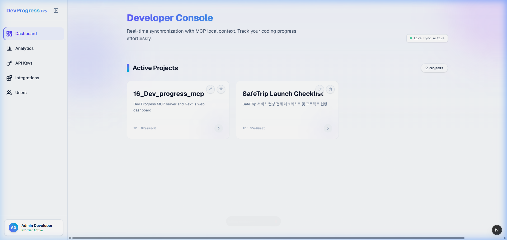
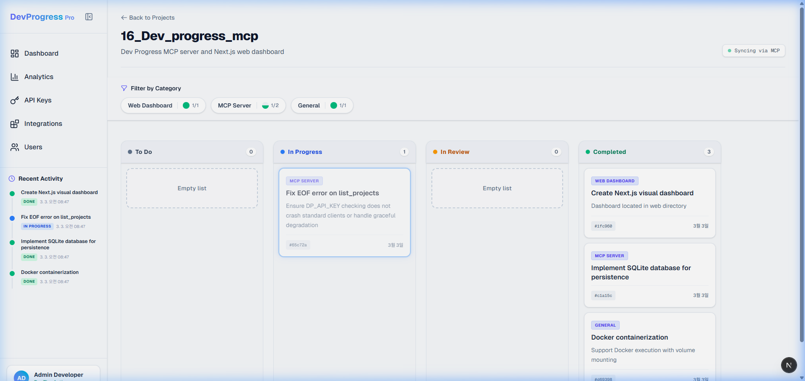

# Vibe Coding Planner (Dev Progress MCP)

A Model Context Protocol (MCP) server & Next.js dashboard designed as a guided planner for vibe-coding beginners. 

This project aims to help developers track their tasks, manage projects, and visualize progress across the 5 Phases of the Vibe Coding lifecycle, seamlessly integrating with AI coding assistants (Cursor, Claude Desktop, etc.) via MCP.

## Features

- **Project Management**: Create and manage multiple projects.
- **Task Tracking**: Add tasks to projects, categorize them, and track their status (TODO, IN_PROGRESS, REVIEW, DONE).
- **Kanban Board Visualization**: Easily retrieve a Markdown-formatted Kanban board for any project.
- **Web Dashboard**: Included Next.js frontend with Timeline views, Analytics, and Integrations management.
- **Secure Authentication**: Requires an API key (`DP_API_KEY`) to ensure only authorized clients can access the MCP server.

## Usage Overview

### Dashboard Overview
The web dashboard provides a clean overview of all your projects and their current progress.


### Kanban Board & Task Details
Manage tasks seamlessly with a visual Kanban board, timeline views, and detailed analytics.


### Video Demonstration


## Installation

```bash
# Clone the repository
git clone https://github.com/hartkimin/Dev_progress_mcp.git
cd Dev_progress_mcp

# Install dependencies for the MCP server
npm install

# Build the MCP server
npm run build
```

## Running the MCP Server

The MCP server uses standard input/output (stdio) for communication. It requires the `DP_API_KEY` environment variable to run. Make sure your database contains valid API keys or you configure the development seating scripts first.

```bash
# Example to run the server directly
DP_API_KEY=your-api-key npm start
```

## Available MCP Tools

Once connected, the MCP server exposes the following tools to the AI assistant:

- `create_project`: Create a new project to track development progress.
- `list_projects`: List all ongoing projects.
- `create_task`: Add a new task to a project.
- `update_task_status`: Move a task across the Kanban board (update status).
- `get_kanban_board`: Retrieve the current Kanban board layout for a specific project.

## Web Dashboard

A full-featured Next.js frontend is available in the `web` directory for visual management of your API keys, projects, and tasks.

```bash
cd web
npm install
npm run dev
```

The web dashboard will be available at [http://localhost:3000](http://localhost:3000).

## License

ISC
